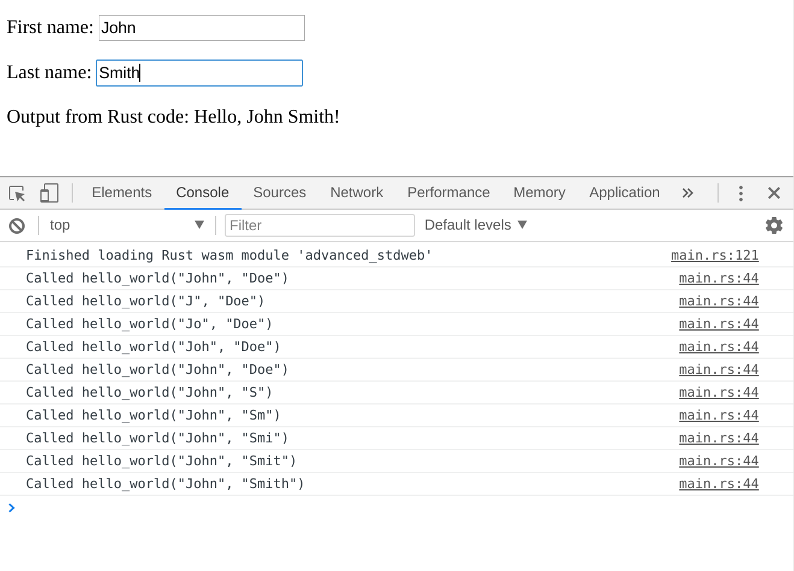

# Advanced stdweb example

This is an advanced example of calling Rust from a browser.

To try out this example, install Rust, `cargo-web` and Yarn (documented elsewhere) and then run:

    yarn install
    yarn build
    serve dist

If everything went well, it should print:

    $ yarn install
    yarn install v1.3.2
    [1/4] Resolving packages...
    [2/4] Fetching packages...
    [3/4] Linking dependencies...
    [4/4] Building fresh packages...
    Done in 5.78s.

    $ yarn build
    yarn run v1.3.2
    $ webpack
    Hash: 7ecc4c45e3121bb52dc6
    Version: webpack 3.10.0
    Time: 1551ms
                             Asset       Size  Chunks             Chunk Names
    static/wasm/main.eaa01ab1.wasm    71.6 kB          [emitted]
        static/js/main.0859a963.js    12.3 kB       0  [emitted]  main
    static/js/main.0859a963.js.map    78.2 kB       0  [emitted]  main
                        index.html  469 bytes          [emitted]
       [0] ./src/index.js 605 bytes {0} [built]
       [1] ./src/main.rs 12.8 kB {0} [built]
        + 3 hidden modules
    Child html-webpack-plugin for "index.html":
         1 asset
           [0] ./node_modules/html-webpack-plugin/lib/loader.js!./src/index.html 870 bytes {0} [built]
           [2] (webpack)/buildin/global.js 509 bytes {0} [built]
           [3] (webpack)/buildin/module.js 517 bytes {0} [built]
            + 1 hidden module
    Done in 2.04s.

    $ serve dist

       ┌─────────────────────────────────────────────────┐
       │                                                 │
       │   Serving!                                      │
       │                                                 │
       │   - Local:            http://localhost:5000     │
       │   - On Your Network:  http://192.168.1.2:5000   │
       │                                                 │
       │   Copied local address to clipboard!            │
       │                                                 │
       └─────────────────────────────────────────────────┘

The resulting web page behaves like this:

